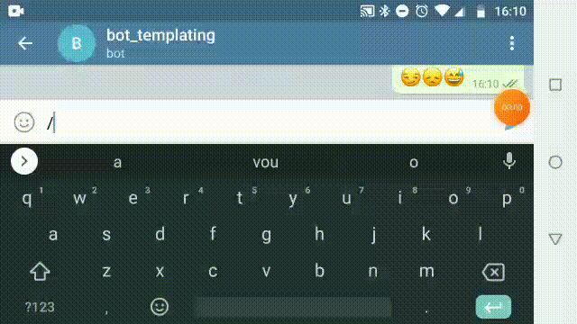
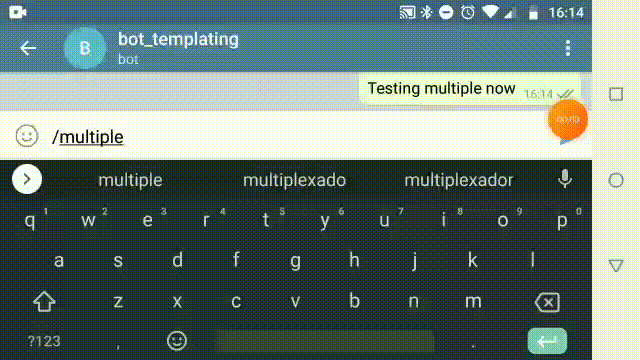

# cool-buttons
Cool dynamic buttons template to use in telegram bots

# Single choice radio button simulation
Check it out

# Multiple choice button simulation
Check it out

# Try it yourself
## Dependency
- [x] curl  
- [x] jq-1.5+  
- [x] bash 4+  

## Get a telegram bot and its token
https://core.telegram.org/bots#6-botfather

## Run

`$ git clone this repository`  
`$ cd this repository`  
`$ chmod +x ./multiple-choice.sh`  
`$ TELEGRAM_TOKEN=<your_bot_token> ./multiple-choice.sh "my_command"`  

>**Find your bot in telegram and use "/my_command" in the conversation screen**

# Customize
You can customize the options editing the array as below

`_OPTIONS=(jpg png svg pdf jpeg)`  
`_OPTIONS=(on off)`  
`_OPTIONS=(green yellow blue gray red white black brown)`  

## Thanks
Best Telegram API for shell environments  
https://github.com/shellscriptx/shellbot/wiki
